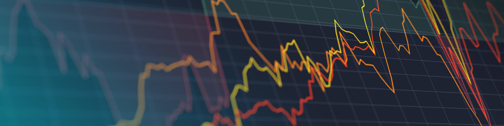

# Exploring Time Series

The purpose of this repository is to practice exploring time series data, in particular, to practice:

- loading the data properly as a Pandas series with datetime index
- manipulating time series stored as a Pandas series
- testing for stationarity
- removing trends
- decomposing a time series

[Image Credit](https://www.kaggle.com/code/marcobr95/time-series-forecasting)